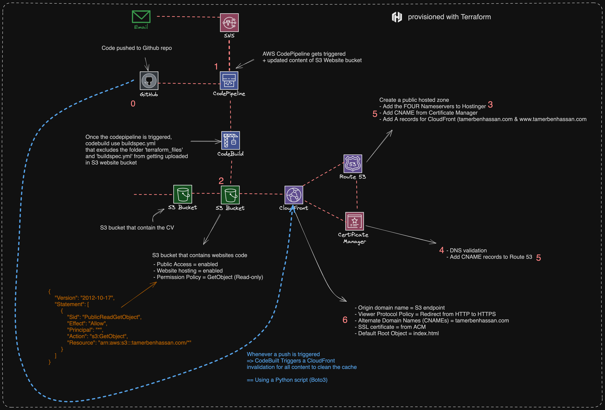

# AWS Infrastructure and Website CI/CD Pipeline

## Overview

This repository contains the code and Terraform configuration for setting up a CI/CD pipeline and infrastructure on AWS for a static website. The infrastructure includes S3 buckets for hosting the website and storing a CV, CloudFront for content delivery, Route 53 for DNS management, and AWS Certificate Manager for SSL certificate provisioning.

### Architecture Overview
The provided architecture diagram outlines the complete workflow:

* **GitHub**: Source code for the website and Terraform files are stored in this repository.
* **AWS CodePipeline**: Automatically triggered upon code push to the GitHub repository.
* **AWS CodeBuil**d: Builds the project, excluding certain files from being uploaded to the S3 website bucket.
* **S3 Buckets**: One for the CV (with GetObject permission policy) and another for the website code (public access, website hosting enabled).
* **AWS CloudFront**: A CDN service that serves the website content, configured to redirect HTTP to HTTPS.
* **AWS Certificate Manager**: Manages SSL certificates for the domain.
* **AWS Route 53**: Manages DNS records, including those necessary for DNS validation of the SSL certificate.

### Prerequisites
* AWS account with permissions to manage CodePipeline, CodeBuild, S3, CloudFront, Certificate Manager, and Route 53.
* Terraform installed for infrastructure as code management.
* Domain name registered and manageable via Route 53.
* GitHub repository for source code management.
  
### Usage
* Fork or clone this repository.
* Ensure all prerequisites are met, including AWS credentials configured for Terraform.
* Push your website code and Terraform configuration files to the repository.
* The push will trigger AWS CodePipeline, which will orchestrate the build and deployment process as outlined in the architecture diagram.
  
### CI/CD Pipeline Stages
* **Source**: Code is fetched from the GitHub repository.
* **Build**: AWS CodeBuild compiles the code, prepares it for deployment, and uploads it to the designated S3 bucket. It also excludes specific files (e.g., Terraform configurations) from the deployment.
* **Deploy**: Updates the S3 bucket containing the website's code and invalidates the CloudFront cache to reflect the changes.
* **DNS Management**: Using Terraform, it sets up Route 53 to manage DNS records, including setting up a public hosted zone and configuring DNS records for CloudFront distribution.
* **Notifications**: AWS Simple Notification Service (SNS) is integrated into the pipeline to send email notifications regarding the status of the pipeline actions, providing immediate updates on successes or failures in the workflow.

### Monitoring and Alerts
* **Amazon SNS**: This service is configured to send email notifications on the success or failure of pipeline executions, ensuring that stakeholders are informed in real-time about the CI/CD process.

### Security and Permissions
The S3 bucket containing the website's code is publicly accessible and configured with a policy that allows only GetObject requests, ensuring read-only access to the website's content.

### Continuous Delivery
Upon every commit to the repository:

* **AWS CodeBuild** automatically triggers.
* **CodeBuild** triggers a CloudFront invalidation to clear the cache, ensuring the latest content is served.
